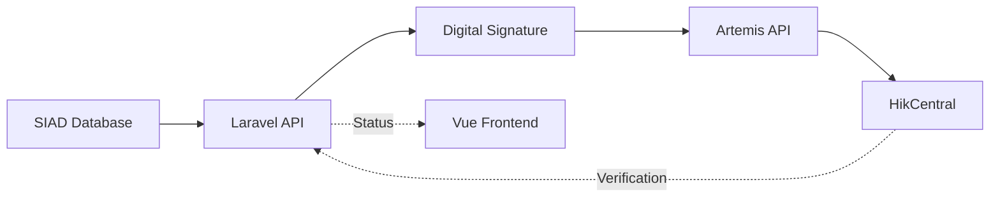

## Overview

The HikCentral Synchronization module manages the bidirectional data flow between the SIAD academic system and the HikCentral biometric platform. This ensures that access control data remains current and accurate across both systems.

## Architecture

### System Components

<CardGroup cols={3}>
  <Card title="SIAD Database" icon="database">
    SQL Server storing personnel photos and academic data
  </Card>
  <Card title="Laravel Backend" icon="server">
    API middleware handling authentication and data transformation
  </Card>
  <Card title="HikCentral Artemis API" icon="shield">
    Biometric system API with digital signature authentication
  </Card>
</CardGroup>

### Data Flow



## Authentication

### Digital Signature

All requests to HikCentral require HMAC-SHA256 digital signature:

```php
// Backend signature generation
$appKey = env('HIKCENTRAL_APP_KEY');
$appSecret = env('HIKCENTRAL_APP_SECRET');

$timestamp = time() * 1000;
$signature = base64_encode(hash_hmac('sha256', $data, $appSecret, true));

$headers = [
    'X-Ca-Key' => $appKey,
    'X-Ca-Signature' => $signature,
    'X-Ca-Signature-Headers' => 'x-ca-timestamp',
    'X-Ca-Timestamp' => $timestamp,
    'Content-Type' => 'application/json'
];
```

<Warning>
  App Key and Secret must be kept secure in environment variables. Never expose these in frontend code.
</Warning>

## Person Registration

### Initial Registration Process

<Steps>
  <Step title="Fetch Person Data from SIAD">
    Retrieve complete profile including:
    - Full name (NombInfPer, ApellInfPer, ApellMatInfPer)
    - ID number (CIInfPer)
    - Email (mailInst)
    - Photo (binary data)
  </Step>
  
  <Step title="Convert Photo to Base64">
    Transform binary photo data to base64 string:
    
    ```php
    $photoBase64 = base64_encode($photoBinary);
    ```
  </Step>
  
  <Step title="Prepare Person Object">
    Create HikCentral person structure:
    
    ```json
    {
      "personName": "Juan Perez Garcia",
      "personId": "1234567890",
      "email": "juan.perez@utlvte.edu.ec",
      "orgIndexCode": "org123",
      "faceList": [
        {
          "faceData": "base64_encoded_photo_data"
        }
      ]
    }
    ```
  </Step>
  
  <Step title="Send POST Request">
    Submit to Artemis API endpoint with signature:
    
    ```javascript
    // Frontend trigger
    const response = await API.post(
      `/biometrico/sync-hikdoc-est-id/${cedula}`,
      {},
      { params: { idper: periodoSeleccionado } }
    );
    ```
  </Step>
  
  <Step title="Process Response">
    Handle HikCentral response codes:
    - Code 0: Success (store returned PersonId)
    - Code 128: Photo incompatible
    - Code 131: Person already exists
  </Step>
</Steps>

### Student Registration Endpoints

**Individual Registration:**

```javascript
POST /biometrico/sync-hikdoc-est-id/{cedula}
Params: { idper: academicPeriodId }

Response:
{
  "code": "0",
  "msg": "Success",
  "data": "uuid-of-created-person"
}
```

**Bulk Registration:**

```javascript
// Get pending list
GET /biometrico/get-pending-sync-est
Params: { carrera_name: programId }

Response:
{
  "pendientes": [
    { "CIInfPer": "1234567890", "NombInfPer": "Juan", ... },
    { "CIInfPer": "0987654321", "NombInfPer": "Maria", ... }
  ]
}
```

### Teacher/Staff Registration Endpoints

**Individual Registration:**

```javascript
POST /biometrico/sync-hikcentral/{cedula}

Response:
{
  "code": "0",
  "msg": "Success",
  "data": "uuid-of-created-person"
}
```

**Bulk Registration:**

```javascript
GET /biometrico/get-pending-sync
Params: { tipoFilter: personnelType }

Response:
{
  "pendientes": [
    { "CIInfPer": "1111111111", "TipoInfPer": "D", ... }
  ]
}
```

## Person Updates

### Update Existing Photo

When facial similarity is low, photos can be updated:

<Steps>
  <Step title="Retrieve PersonId">
    Get HikCentral UUID from verification:
    
    ```javascript
    const response = await API.get(`/biometrico/getperson-est/${cedula}`);
    this.personIdHC = response.data.personId;
    ```
  </Step>
  
  <Step title="Send Update Request">
    Include PersonId in request body:
    
    ```javascript
    // Student update
    await API.post(
      `/biometrico/sync-hikdoc-update/${cedula}`,
      { personaId: personIdHC },
      { params: { idper: periodoSeleccionado } }
    );
    
    // Teacher update
    await API.post(
      `/biometrico/sync-hikdupdatedoce/${cedula}`,
      { personaId: personIdHC }
    );
    ```
  </Step>
  
  <Step title="Verify Update">
    Re-fetch photo and calculate new similarity
  </Step>
</Steps>

<Note>
  Updates require the PersonId UUID from HikCentral. Always verify registration status before attempting updates.
</Note>

## Status Verification

### Check Registration Status

**Single Person Verification:**

```javascript
async verificarRegistroHC(ci) {
  this.cargandoStatus = true;
  try {
    // Students
    const response = await API.get(`/biometrico/getperson-est/${ci}`);
    
    // Teachers/Staff
    // const response = await API.get(`/biometrico/getperson/${ci}`);
    
    this.personIdHC = response.data.personId;
    this.estaRegistrado = response.data.registrado;
  } catch (error) {
    this.estaRegistrado = false;
  } finally {
    this.cargandoStatus = false;
  }
}
```

**Response Structure:**

```json
{
  "registrado": true,
  "personId": "8a8a8a8a-1234-5678-9abc-def012345678"
}
```

### Bulk Status Verification

Verify multiple people sequentially:

```javascript
async verificarRegistrosMasivos() {
  const items = this.filteredpostulaciones;
  
  for (let post of items) {
    if (this.cargando) break; // Allow user to cancel
    
    try {
      const res = await API.get(`/biometrico/getperson-est/${post.CIInfPer}`);
      post.estaRegistradoHC = res.data.registrado;
    } catch (e) {
      post.estaRegistradoHC = false;
    }
    
    // Rate limiting: 50ms delay between requests
    await new Promise(resolve => setTimeout(resolve, 50));
  }
}
```

<Warning>
  Rate limiting is essential to prevent HTTP 429 (Too Many Requests) errors from HikCentral API.
</Warning>

## Bulk Synchronization

### Mass Sync Workflow

<Steps>
  <Step title="Initiate Sync">
    User clicks "Sincronizar Pendientes (Masivo)" button
    
    ```javascript
    async iniciarSincronizacionMasiva() {
      if (!confirm("Se buscarán usuarios no registrados y se enviarán a HikCentral. ¿Continuar?")) {
        return;
      }
      this.syncMode = true;
      this.syncIndex = 0;
    }
    ```
  </Step>
  
  <Step title="Fetch Pending List">
    Retrieve all unregistered persons:
    
    ```javascript
    const { data } = await API.get('/biometrico/get-pending-sync-est', {
      params: { carrera_name: this.selectedCarrera }
    });
    this.pendientes = data.pendientes;
    ```
  </Step>
  
  <Step title="Sequential Processing">
    Process each person one by one:
    
    ```javascript
    for (const p of this.pendientes) {
      this.currentSyncName = p.NombInfPer;
      
      try {
        const res = await API.post(`/biometrico/sync-hikdoc/${p.CIInfPer}`);
        
        if (res.data.code === "0" || res.data.msg === "Success") {
          console.log(`✅ Sincronizado: ${p.CIInfPer}`);
        } else if (res.data.code === "131") {
          console.warn(`⚠️ Ya registrado: ${p.CIInfPer}`);
        } else if (res.data.code === "128") {
          console.warn(`❌ Foto incompatible: ${p.CIInfPer}`);
        }
      } catch (e) {
        console.error(`❌ Error: ${p.CIInfPer}`, e.response?.data);
      }
      
      this.syncIndex++;
      await new Promise(resolve => setTimeout(resolve, 300));
    }
    ```
  </Step>
  
  <Step title="Complete and Refresh">
    Show completion message and refresh table:
    
    ```javascript
    alert("Sincronización masiva finalizada.");
    this.getAdministrativosD(this.currentPage, this.searchQuery, this.selectedCarrera);
    this.syncMode = false;
    ```
  </Step>
</Steps>

### Progress Tracking

Real-time progress display during sync:

```vue
<div v-if="syncMode" class="mb-4 p-4 border rounded-xl bg-gray-50">
  <div class="flex justify-between mb-2">
    <span class="text-sm font-medium">
      Sincronizando con HikCentral: {{ syncIndex }} / {{ pendientes.length }}
    </span>
    <span class="text-sm font-bold">{{ progressSync }}%</span>
  </div>
  
  <div class="w-full bg-gray-200 rounded-full h-2.5">
    <div class="bg-brand-500 h-2.5 rounded-full transition-all duration-300"
         :style="{ width: progressSync + '%' }">
    </div>
  </div>
  
  <p class="text-xs mt-2 text-gray-500 italic">
    Procesando: {{ currentSyncName }}
  </p>
</div>

<button 
  @click="iniciarSincronizacionMasiva" 
  :disabled="cargando || syncMode"
  class="btn btn-primary">
  Sincronizar Pendientes (Masivo)
</button>
```

**Progress Calculation:**

```javascript
computed: {
  progressSync() {
    return this.pendientes.length > 0
      ? Math.round((this.syncIndex / this.pendientes.length) * 100)
      : 0;
  }
}
```

## Photo Retrieval from HikCentral

### Fetch Person Photo

Retrieve current photo from biometric system:

```javascript
// Frontend photo URL
getPhotoUrl2(ci) {
  const baseURL = API.defaults.baseURL;
  return `${baseURL}/biometrico/gethick/${ci}?t=${new Date().getTime()}`;
}
```

**Backend Process:**

1. Search person by ID in HikCentral
2. Extract PersonId from search results
3. Call face photo endpoint with PersonId
4. Return image with proper content-type headers

### Search Person Endpoint

```php
// Backend search in HikCentral
POST /artemis/api/resource/v1/person/advance/personList
{
  "pageNo": 1,
  "pageSize": 1,
  "personId": "1234567890"
}

Response:
{
  "code": "0",
  "data": {
    "list": [
      {
        "personId": "uuid",
        "personName": "Juan Perez"
      }
    ]
  }
}
```

## Response Codes

### HikCentral API Codes

<CardGroup cols={2}>
  <Card title="Code 0" icon="check" color="#10b981">
    **Success** - Operation completed successfully
  </Card>
  <Card title="Code 128" icon="image-slash" color="#ef4444">
    **Invalid Photo** - Photo format or quality incompatible
  </Card>
  <Card title="Code 131" icon="user-check" color="#f59e0b">
    **Already Exists** - Person already registered in system
  </Card>
  <Card title="Code 429" icon="triangle-exclamation" color="#ef4444">
    **Too Many Requests** - Rate limit exceeded
  </Card>
</CardGroup>

### Error Handling

```javascript
try {
  const response = await API.post(`/biometrico/sync-hikcentral/${cedula}`);
  
  switch (response.data.code) {
    case "0":
      alert(`✅ Registrado con éxito. ID: ${response.data.data}`);
      break;
    
    case "128":
      alert("❌ La foto no es compatible con HikCentral.");
      this.estaRegistrado = false;
      break;
    
    case "131":
      alert("⚠️ Usuario ya registrado en HikCentral.");
      this.estaRegistrado = true;
      break;
    
    default:
      alert(`⚠️ Respuesta del servidor: ${response.data.msg}`);
  }
} catch (error) {
  console.error("Error al sincronizar:", error);
  const mensaje = error.response?.data?.details?.msg || 
                  "Error desconocido al conectar con el Biométrico";
  alert(`❌ Error: ${mensaje}`);
}
```

## Rate Limiting Strategy

### Preventing API Overload

<Warning>
  HikCentral API has strict rate limits. Sequential processing with delays is essential.
</Warning>

**Implementation:**

```javascript
// Individual verification with 50ms delay
for (let post of items) {
  await API.get(`/biometrico/getperson/${post.CIInfPer}`);
  await new Promise(resolve => setTimeout(resolve, 50));
}

// Bulk registration with 300ms delay
for (const person of pendientes) {
  await API.post(`/biometrico/sync-hikdoc/${person.CIInfPer}`);
  await new Promise(resolve => setTimeout(resolve, 300));
}
```

### Handling 429 Errors

```javascript
catch (error) {
  if (error.response?.status === 429) {
    alert("El servidor reportó 'Too Many Requests' (429). " +
          "Por favor, inténtelo de nuevo en un momento.");
  }
}
```

## Data Mapping

### SIAD to HikCentral Field Mapping

| SIAD Field | HikCentral Field | Notes |
|------------|------------------|-------|
| `CIInfPer` | `personId` | ID number |
| `NombInfPer + ApellInfPer + ApellMatInfPer` | `personName` | Full name |
| `mailInst` | `email` | Institutional email |
| `Fotografia` (binary) | `faceData` (base64) | Photo conversion required |
| N/A | `orgIndexCode` | Fixed organization code |

### Person Object Structure

```json
{
  "personName": "Juan Alberto Perez Garcia",
  "personId": "1234567890",
  "email": "juan.perez@utlvte.edu.ec",
  "orgIndexCode": "organizationCode123",
  "faceList": [
    {
      "faceData": "/9j/4AAQSkZJRgABAQEAYABgAAD..."
    }
  ]
}
```

## Best Practices

<Card title="Synchronization Guidelines" icon="list-check">
  1. **Always verify status** before attempting registration
  2. **Use PersonId for updates** - never create duplicates
  3. **Implement rate limiting** in all bulk operations
  4. **Handle response codes** appropriately for each scenario
  5. **Log failures** during bulk sync for manual review
  6. **Compare photos** after synchronization to verify quality
  7. **Refresh data** after bulk operations complete
  8. **Monitor progress** during long-running batch processes
  9. **Secure API credentials** in environment variables
  10. **Test with small batches** before full sync
</Card>

## Troubleshooting

### Common Issues

<AccordionGroup>
  <Accordion title="Photo Upload Fails with Code 128">
    **Cause**: Photo doesn't meet HikCentral quality requirements
    
    **Solution**:
    - Verify photo resolution and format
    - Ensure face is clearly visible and frontal
    - Check for plain background
    - Consider re-taking photo in SIAD
  </Accordion>
  
  <Accordion title="Duplicate Registration (Code 131)">
    **Cause**: Person already exists in HikCentral
    
    **Solution**:
    - Use update endpoint instead of create
    - Retrieve PersonId first
    - Check verification status before registration
  </Accordion>
  
  <Accordion title="Rate Limit Errors (429)">
    **Cause**: Too many requests in short timeframe
    
    **Solution**:
    - Increase delay between requests (300ms+)
    - Process in smaller batches
    - Retry after waiting period
  </Accordion>
  
  <Accordion title="Photos Don't Update">
    **Cause**: Browser caching old images
    
    **Solution**:
    - Add timestamp parameter to photo URLs
    - Update refreshKey after sync
    - Force browser cache clear
  </Accordion>
</AccordionGroup>